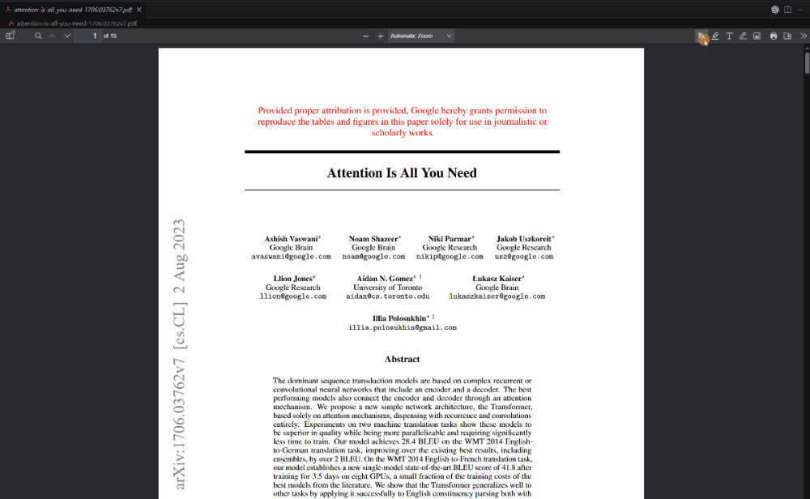

<div align="center">


# ParaRead

**Hover over a sentence in a paper, and its translation sits right beside it, at the same height.**
Read foreign-language PDF papers sentence by sentence in VS Code.

[](https://github.com/Chuanyunux/pararead/actions/workflows/ci.yml)
[](https://github.com/Chuanyunux/pararead/releases)
[](LICENSE)
[](https://code.visualstudio.com/)

**English** · [简体中文](README.zh-CN.md)

</div>



<!-- More demos (demos/): demo-panel.gif (show original, switch language), demo-setup.gif (set up the service). -->

## Why ParaRead

A translated paper hides what the original says, and copying paragraphs into a translator means switching windows all the time. ParaRead keeps the translation next to the original, **sentence by sentence**:

- 🎯 **Sentence linking**: rest the pointer on a sentence and it is outlined, an arrow points to its translation, and both stay level. The translation scrolls with the paper.
- 📄 **Layout-preserving translation**: the panel typesets headings, paragraphs, lists, captions, footnotes and code like a real document, not a list of lines.
- 🌐 **11 languages, in any direction**: 简体中文, 繁體中文, English, 日本語, 한국어, Français, Deutsch, Español, Português, Русский, Italiano. The paper's language is detected sentence by sentence, and Chinese and Japanese papers are split at full-width punctuation. The interface is in English or Chinese, following VS Code.
- ✍️ **Still a full PDF reader**: highlight, comment and draw with PDF.js tools; `Ctrl+S` saves annotations into the PDF.

## Get started

1. Install **ParaRead** from the [VS Code Marketplace](https://marketplace.visualstudio.com/items?itemName=chuanyunux.pararead) (search "ParaRead" in the Extensions view), or download the `.vsix` from [Releases](https://github.com/Chuanyunux/pararead/releases) and run **Extensions: Install from VSIX...**.
2. Run **ParaRead: Set Up Translation Service** from the Command Palette: choose a service ([DeepSeek](https://platform.deepseek.com/) by default), confirm the model and enter the API key.
3. Open any PDF. On the first paper, ParaRead confirms the translation language (by default the VS Code display language). The pages you read are translated automatically; rest the pointer on a sentence to compare.

Requires VS Code 1.95 or later.

## Usage

| Action                                | Result                                                                   |
| ------------------------------------- | ------------------------------------------------------------------------ |
| Rest the pointer on a sentence        | Selects it: outline, arrow to the translation, translation aligned to it |
| Click / Alt+click a sentence          | Selects it and translates its paragraph right away                       |
| Click empty space / `Esc`             | Clears the selection                                                     |
| Hover / click a translation           | Finds the original sentence (click scrolls to it)                        |
| **Show original** in the panel header | Shows the original under each translated paragraph                       |
| Language button in the panel header   | Shows the translation language; click to change it                       |
| Panel icon in the toolbar             | Shows or hides the panel; drag the splitter to resize it                 |
| **ParaRead: Translate Whole Paper**   | Translates everything after a confirmation, with progress; cancellable   |

## How it compares

|                                                                    | ParaRead | Immersive Translate | PDFMathTranslate         | Other VS Code translators |
| ------------------------------------------------------------------ | -------- | ------------------- | ------------------------ | ------------------------- |
| Read inside VS Code                                                | ✅       | ❌ browser          | ❌ standalone / Zotero   | ✅                        |
| Sentence-level linking, original and translation level             | ✅       | ❌                  | ❌                       | ❌                        |
| Translation keeps paragraphs, headings, etc.                       | ✅       | ✅                  | ✅ (generates a new PDF) | mostly plain text         |
| Annotations saved into the original PDF                            | ✅       | ❌                  | ❌                       | some                      |
| Your choice of model (DeepSeek / OpenAI-compatible / local Ollama) | ✅       | ✅                  | ✅                       | depends                   |

If you need a translated PDF with the layout fully preserved, PDFMathTranslate is the better fit. If you want to **read the original with the translation beside it**, try ParaRead.

## Models, cost and privacy

- **DeepSeek by default** (`deepseek-flash`), or any OpenAI-compatible API. **Set Up Translation Service** has presets for DeepSeek, OpenAI, Qwen, Kimi, GLM, SiliconFlow, OpenRouter, Google Gemini, Ollama and LM Studio. With a local [Ollama](https://ollama.com/), everything stays offline and no API key is needed.
- **Cached per sentence**: translations are stored on your machine, so reopening a paper makes no API calls and costs nothing. The **ParaRead** output channel logs the token usage of every call.
- **Only the sentences to translate** are sent to the service you configured. The API key is kept in VS Code's secret storage, is never written to a file, and never reaches the webview (which has no network access).
- The cache lives in the extension's storage folder (`pararead.cacheDir` to change it); nothing is written next to your papers, and PDFs are only modified when you save annotations.

<details>
<summary>All settings</summary>

| Setting                       | Default                    | Description                                                                                                                                  |
| ----------------------------- | -------------------------- | -------------------------------------------------------------------------------------------------------------------------------------------- |
| `pararead.baseUrl`            | `https://api.deepseek.com` | OpenAI-compatible API address; `http://localhost:11434/v1` for Ollama                                                                        |
| `pararead.model`              | `deepseek-flash`           | Model name of the service                                                                                                                    |
| `pararead.targetLanguage`     | `auto`                     | Translation language; `auto` follows the VS Code display language, or `zh-CN`, `zh-TW`, `en`, `ja`, `ko`, `fr`, `de`, `es`, `pt`, `ru`, `it` |
| `pararead.sourceLanguage`     | `auto`                     | Language of the papers; `auto` detects it per sentence                                                                                       |
| `pararead.temperature`        | `0.7`                      | Lower values give more consistent terminology                                                                                                |
| `pararead.extraBody`          | `{}`                       | Extra request fields; fields a service needs are added automatically (thinking mode off for DeepSeek)                                        |
| `pararead.translateRange`     | `nearby`                   | What to translate automatically: `page`, `nearby` (current page and its neighbours) or `manual`                                              |
| `pararead.glossary`           | `{}`                       | Glossary, e.g. `{"attention": "注意力"}`, or per language: `{"ja": {"attention": "アテンション"}}`                                           |
| `pararead.selectOnHover`      | `true`                     | Select sentences on hover; when off, only clicks select                                                                                      |
| `pararead.maxCharsPerRequest` | `3000`                     | Maximum source characters per request                                                                                                        |
| `pararead.requestTimeout`     | `60000`                    | Request timeout in milliseconds                                                                                                              |
| `pararead.cacheDir`           | empty                      | Custom cache directory                                                                                                                       |

</details>

## FAQ

**Is the whole PDF uploaded?** No. Only the text of the sentences to translate is sent to the service you configured; the PDF file never leaves your machine.

**How well does it handle two-column papers?** Two columns, paragraphs interrupted by figures and paragraphs continuing in the next column are supported. Known limits: a sentence split across pages becomes two sentences, display equations may be taken for sentences, and author lists on the title page may be taken for headings.

**Which paper languages are supported?** Horizontal Chinese, Japanese, Korean, Russian, English, French, German, Spanish, Portuguese and Italian. Vertical layouts and right-to-left languages (e.g. Arabic) are not supported yet.

**The panel shows the original instead of a translation?** Unless you choose one, the translation language is the VS Code display language, so an English paper in an English VS Code is already "translated". Click the language button in the panel header, or run **ParaRead: Choose Translation Language**.

**Can I use only a local model?** Yes. Run **Set Up Translation Service**, choose Ollama or LM Studio and enter a model you have downloaded; no API key is needed.

**Which services work?** Any service with an OpenAI-compatible `/chat/completions` API and JSON output mode. Azure OpenAI (different authentication) and services with only a native API are not supported directly; an OpenAI-compatible gateway such as OpenRouter works. Some reasoning models reject `temperature` or `max_tokens`; prefer a regular chat model.

**Does it touch my existing annotations?** No. ParaRead's selection outline is only drawn on screen, never written to the PDF, and hovering existing annotations does not select sentences.

## Roadmap

- [ ] Study mode: translations blurred until clicked
- [ ] Export a bilingual Markdown file
- [ ] Vocabulary book: Alt+double-click to look up a word, export to Anki
- [ ] Publish on Open VSX

Ideas and bug reports are welcome in [Issues](https://github.com/Chuanyunux/pararead/issues).

## Development

```sh
pnpm install
pnpm run build      # build the extension and the webview
pnpm test           # unit tests (the first run downloads a test paper from arXiv)
pnpm run check      # type check, lint and format check
```

Press `F5` in VS Code to start an Extension Development Host, or run `pnpm run harness` and open `http://localhost:5178/?pdf=papers/<file>.pdf` to debug the webview in a browser (`papers/` is not tracked). See [CONTRIBUTING.md](CONTRIBUTING.md); a first pull request needs the [Contributor License Agreement](CLA.md).

### Updating PDF.js

- Update `pdfjs_version.txt` to the target version and hash.
- Run `tools/prepare_pdfjs.sh` from the repository root. It downloads PDF.js and applies the patches in `patches/`; on conflicts, resolve the generated `*.rej` files in `assets/pdf.js` and delete them.
- To add patches while keeping the current version, run it with `--update-patches`, edit `assets/pdf.js` when prompted, and the script regenerates the patch. It does not create commits.

## Credits & License

ParaRead is a modified version of [vscode-pdf](https://github.com/mathematic-inc/vscode-pdf) by Mathematic Inc and bundles [PDF.js](https://mozilla.github.io/pdf.js/) by Mozilla, both licensed under Apache-2.0. It is not affiliated with or endorsed by either project.

Licensed under [Apache-2.0](LICENSE); see [NOTICE](NOTICE).
